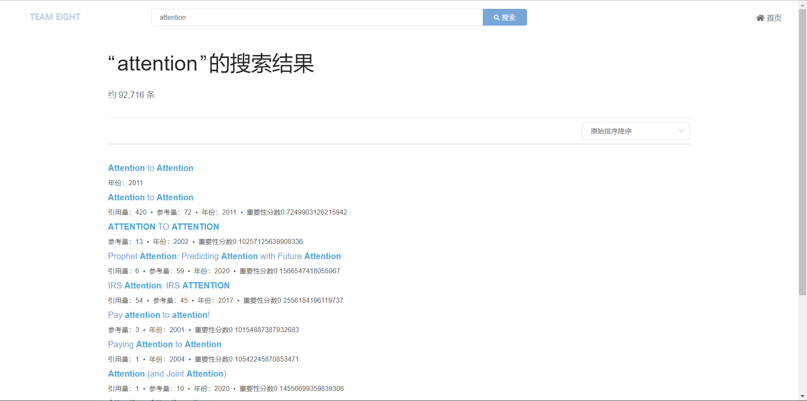
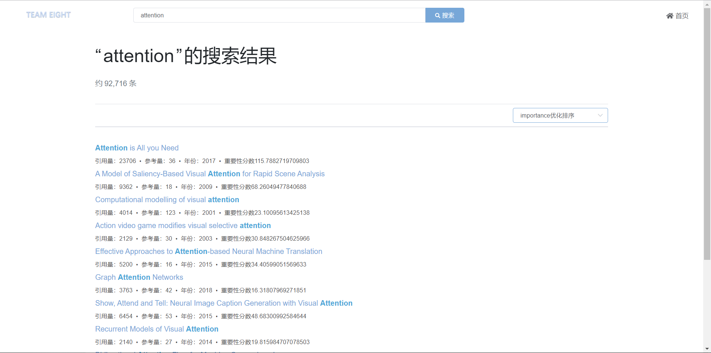

# team8-Citation network-based paper retrieval engine


## 项目说明

### Project3:  基于引文网络的论文检索引擎

引文网络是由文献间引用和被引用的关系构成的集合。该网络中的节点是文献，边代表了文献间的引用关系。

#### 数据处理模块

+ Semantic Scholar上从2000年以后的英文论文，大小为**120G**。以`sample.jsonl`为例，每行为一条数据，包括论文标题、论文引用和被引关系等字段。完整数据请在确认选题后找助教拷贝

##### 要求

+ 使用大规模数据处理技术，例如Spark
+ 构建**引文网络**来计算论文重要性分数
    + 使用的算法必须说明原理
    + 基于引文网络的重要性分数必须作为一个字段保存进MongoDB数据库

#### 检索模块

+ 搭建Elasticsearch实现从某一个或若干字段检索
+ 再**结合**引文网络重要性分数对检索结果进行调整，对比二者，期望引文网络重要性分数对搜索结果有所改善，能结合**具体案例**分析说明
+ 当选中一篇论文后，能够以该节点为中心展示引文网络子图
    + 应当包括之前和之后的节点
    + 应根据节点互相引用的关系、节点重要性筛选出一定数量的节点用于展示
    + 应提供引文网络子图的节点和边的信息，并和展示模块商量好接口定义

#### 展示模块

- 设计并实现一个学术论文搜索引擎网站，包括三个页面

    - 首页/搜索页
    - 检索结果列表页，要求：
        - 可以显示ES基础检索结果列表
        - 可以显示基于引文网络重要性分数改善后的检索结果列表

    + 论文详情页面：

        + 基于选中的论文，可视化一个**引文网络子图**，可以参考https://www.connectedpapers.com/。根据重要性分数，节点的大小或颜色应该有所区分

        <div align="center">
          
        </div>

- 推荐使用Python Django（[https://www.djangoproject.com](https://www.djangoproject.com/)）库来实现

#### 提交内容

+ 一个MongoDB数据库，包含引文网络重要性字段
+ 引文网络的统计信息，节点数、边数、最大出入度等
+ 展示基于引文网络的论文检索引擎的检索结果，并能结合**具体案例**说明基于引文网络的重要性分数对检索结果的改善
+ 展示引文网络子图的可视化效果


## 项目环境

### Spark

* 系统：Ubuntu 16.04.6 LTS
* ip: 10.108.17.185
* web UI port: 4041
* hadoop: v3.3.1
* scalar: v2.12
* spark: v3.2.0
* 路径: `/usr/local/spark`

### ES

* version: v7.15.2
* ip: 10.108.17.104
* port: 9200
* 配置文件位置: `/home/solid/elasticsearch/config/elasticsearch.yml`

### MongoDB

* version: v3.6.3
* ip: 10.108.17.104
* port: 27017
* 数据文件位置: `/home/solid/db/data`
* 日志文件位置:`/home/solid/db/log`
* 配置文件位置:`/etc/mongodb.conf`

### kibana

* version: v7.15.2
* ip: 10.108.17.104
* port: 5601
* 配置文件位置:`/home/solid/kibana/config/kibana.yml`

### monstache

* version: v6.7.6
* 配置文件位置:`/home/solid/monstache/config.toml`

### · Python环境

个人Python环境请使用`miniconda`进行创建和配置，尽量不要使用sudo安装，以免污染他人环境。

### · 前端环境
* Node.js 
* npm 
* Vue CLI 


## 常用命令

### 1. 校园网登入、登出

脚本位置`/home/public`

```shell
cd /home/public
# 登入命令：
bash weblogin 学号 密码
# 登出命令：
bash weblogout 学号 密码
```

### 2. MongoDB

```shell
# 登入root用户
su
# 进入MongoDB的tmux环境
tmux a -t mongodb
# 启动MongoDB服务
service mongodb start
# 停止MongoDB服务
service mongodb stop
# 重启MongoDB服务
service mongodb restart
# 进入MongoDB
mongo
# 查看所有database
show dbs
# 查看所有collections
show collections
# 创建database
use db_name
# 创建集合
db.createCollection("collection_name")
# 删除集合
db.collection_name.drop()
```

### 3. ES

```shell
# 登入lsh用户
su lsh
# 进入ES的tmux环境
tmux a -t es
```

### 4. 前端
在前端根目录下
```shell
# 安装依赖组件包
npm install
# 使用调试模式打开网站
npm run serve
# 使用生产模式打包部署
npm run build
```


## 代码说明

### 0. 数据处理

代码：`/src/data processing/importance.py`

含重要性得分的文件示例：`/src/data processing/part_0.jsonl`

写入文件的日志：`/src/data processing/calc_ir.out`


从`/home/data/citation_data`读取并解析MongoDB中原始数据，使用Spark计算论文重要性得分，并导出至`/home/solid/citation_data_final`，用于下一步处理工作。

环境：
- Spark 3.2.0
- Python 3.6.9

### 1. MongoDB数据

原始数据： `/home/data/citation_data`

包含重要性字段数据：`/home/solid/citation_data_final`

数据入库（对应库中代码：`/src/server/importData.sh`）：

```shell
bash importData.sh 1499
```

创建视图（对应库中代码：`/src/server/createView.txt`）：

```shell
# mongo
rs:PRIMARY> use IR
rs:PRIMARY> db.createView("citationsView", "citations", [{$project: {"Sid": 1, "title": 1, "year": 1, "inCitationsCount": 1, "outCitationsCount": 1, "importance": 1}}])
```

### 2. 创建ES索引

删除原有索引，并创建新索引（对应库中代码：`/src/server/build_citations.sh`）：

```
bash build_citations.sh
```

### 3. 同步DB-ES

将MongoDB中的数据同步到ES索引中

Tool: `monstache`

cmd（对应库中配置文件：`/config/monstache/config.toml`）

```shell
monstache -f /home/solid/monstache/config.toml
```

### 4. 前端部分

基于Vue框架结合element-ui组件库进行开发（对应库中代码：/src/fontend）

### 5.  接口部分

基于flask的后端接口搭建，使用python进行ES和MongoDB检索并返回结果（对应库中代码：`/src/backend/`）


## 接口说明

1. **query**

  - **说明**
    - 主查询，根据query在title中检索并返回相应的文档。
  - **参数**
    - `type`：查询类型
    - `query`：查询内容
    - `from`：返回分页结果的第几页
    - `size`：每一页的文档数量
    - `filter_year`：是否按年份过滤，值为true或false，在后端会映射为python中的True或False
    - `s_year`：年份过滤的起始年份
    - `e_year`：年份过滤的结束年份
    - `sort_by_time`：是否按时间排序。值为false、desc或asc。false表示不排序，desc表示按降序排列，desc表示按升序排列，下同
    - `sort_by_incite`：是否按被引用量排序  
    - `sort_by_outcite`：是否按引用量排序  
    - `sort_by_importance`：是否按重要性排序。值为true或false，在后端会映射为python中的True或False

2. **citations**

  - **说明**
    - 引用网络查询，根据query论文的Sid递归检索其引用和被引用论文信息
  - **参数**
    - `type`：查询类型
    - `sid`：query论文的Sid
    - `depth`：递归深度
    - `length`：引用查询展开深度

## 提交说明

请在`project3-team8`中创建个人分支，将所有修改提交到个人分支中，确定无误后再合并至主分支，以避免污染主分支，并且方便出现问题后进行回滚操作。

## 界面展示

- 首页搜索页面
  <div align="center">
    
  </div>
- 搜索结果页面
  原始结果展示：
  <div align="center">
    
  </div>
  改善后的结果展示：
  <div align="center">
    
  </div>
- 论文详情页 
   <div align="center">
    
    
  </div>
